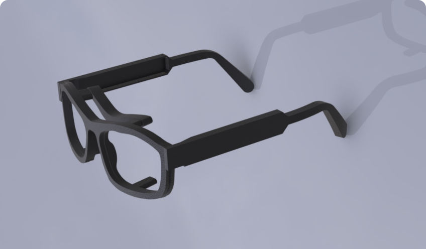
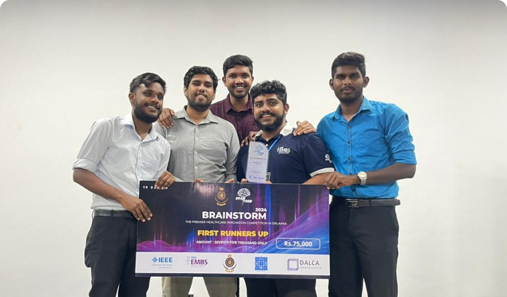
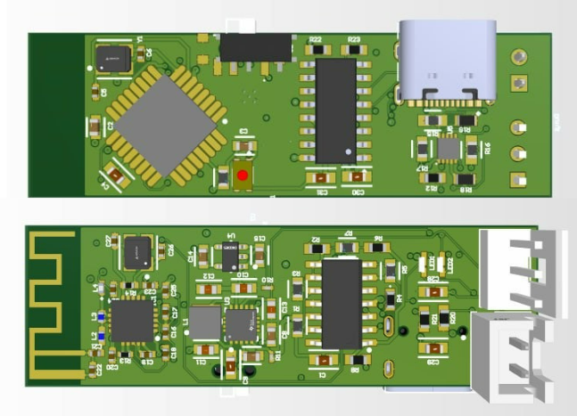
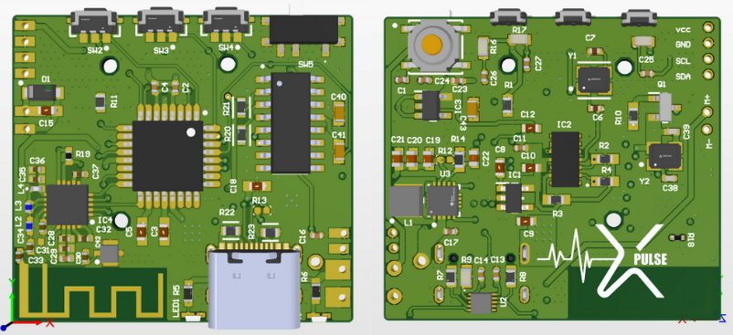

# SteerSafe 🚗💡

*SteerSafe Device*

## Overview

**SteerSafe** is an advanced, adaptable system that enhances driving safety through intelligent technology. Utilizing advanced RF communication and a versatile design, SteerSafe is compatible with various types of spectacles, including sunglasses and regular glasses. Its lightweight and power-efficient design ensures seamless integration and optimal performance for drivers in any setting.

## Key Features

- **Adaptability**: Works with any driver and a range of spectacles (sunglasses, regular glasses). 👓🕶️
- **Power Efficiency**: Employs RF-based communication to minimize power consumption. 🔋
- **Lightweight Design**: Compact and portable, perfect for easy integration. 🏎️
- **Modular and Upgradeable**: Customizable to various use cases and easily upgradable. 🔧

## Photos

### Team 👥

Here’s the team behind SteerSafe:

*The SteerSafe Development Team*

### Device 📱

See the SteerSafe device in action:

//*SteerSafe Device*

### PCB Designs 🖥️

Here are detailed images of the SteerSafe PCBs:

| PCB Type        | Image                           | Description             |
|-----------------|---------------------------------|-------------------------|
| **PCB 1**       |  | PCB for the Spectacles     |
| **PCB 2**       |  | PCB for the Wristband    |

## License 📝

This project is licensed under the MIT License – see the [LICENSE](LICENSE) file for more details.

## Contact 📧

For more information or inquiries, please reach out to the development team:

- **Prabath Wijethilake**
- **Anushka Samaranayake**
- **Savinu Aththanayake**
- **H.L.N.B. Haputhanthri**
- **Sajitha Madugalle**
